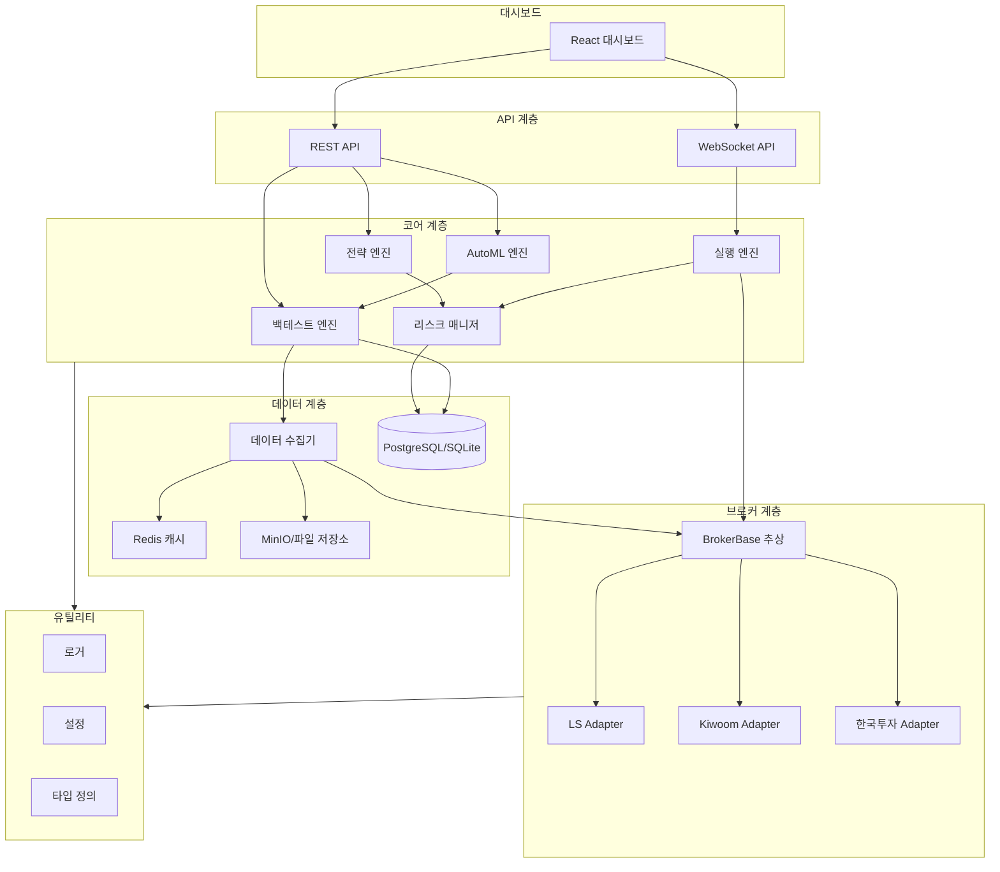

# 설계 문서

## 개요

LS증권_개인화_HTS는 계층화된 아키텍처를 기반으로 한 자동매매 플랫폼입니다. 핵심 설계 원칙은 **느슨한 결합(Loose Coupling)**과 **의존성 역전(DIP)**을 통해 증권사 API를 교체 가능하게 만들고, 전략 코드를 브로커 구현으로부터 완전히 분리하는 것입니다.

시스템은 5개의 주요 계층으로 구성됩니다:
- **브로커 계층(Broker Layer)**: 증권사 API를 추상화하는 Adapter 패턴
- **코어 계층(Core Layer)**: 전략, 백테스트, 실행, 리스크 관리 엔진
- **데이터 계층(Data Layer)**: OHLC 데이터 수집 및 캐싱
- **API 계층(API Layer)**: FastAPI 기반 REST/WebSocket 서버
- **대시보드 계층(Dashboard Layer)**: React 기반 웹 UI

## 아키텍처

### 상위 수준 아키텍처



### 의존성 규칙

계층 간 의존성은 단방향으로만 흐릅니다:

1. **대시보드** → API 계층
2. **API 계층** → 코어 계층 + 브로커 계층
3. **코어 계층** → 유틸리티 계층
4. **브로커 계층** → 유틸리티 계층
5. **데이터 계층** → 브로커 계층 + 유틸리티 계층

이 규칙을 통해 하위 계층의 변경이 상위 계층에 영향을 주지 않습니다.

## 컴포넌트 및 인터페이스

### 1. 브로커 계층

#### BrokerBase (추상 기본 클래스)

모든 증권사 Adapter가 구현해야 하는 인터페이스입니다.

```python
from abc import ABC, abstractmethod
from typing import List, Dict, Any, AsyncIterator
from datetime import datetime
from utils.types import OHLC, Order, Position, Account

class BrokerBase(ABC):
    """모든 브로커 어댑터의 추상 기본 클래스"""
    
    @abstractmethod
    async def get_ohlc(
        self,
        symbol: str,
        interval: str,
        start_date: datetime,
        end_date: datetime
    ) -> List[OHLC]:
        """과거 OHLC 데이터 가져오기"""
        pass
    
    @abstractmethod
    async def get_current_price(self, symbol: str) -> float:
        """현재 시장 가격 가져오기"""
        pass
    
    @abstractmethod
    async def place_order(self, order: Order) -> str:
        """새 주문 제출, order_id 반환"""
        pass
    
    @abstractmethod
    async def cancel_order(self, order_id: str) -> bool:
        """기존 주문 취소"""
        pass
    
    @abstractmethod
    async def amend_order(self, order_id: str, new_price: float, new_quantity: int) -> bool:
        """기존 주문 수정"""
        pass
    
    @abstractmethod
    async def get_account(self) -> Account:
        """계좌 정보 가져오기 (잔액, 자산 등)"""
        pass
    
    @abstractmethod
    async def get_positions(self) -> List[Position]:
        """모든 보유 포지션 가져오기"""
        pass
    
    @abstractmethod
    async def get_open_orders(self) -> List[Order]:
        """모든 미체결 주문 가져오기"""
        pass
    
    @abstractmethod
    async def stream_realtime(self, symbols: List[str]) -> AsyncIterator[Dict[str, Any]]:
        """WebSocket을 통한 실시간 가격 업데이트 스트리밍"""
        pass
```

#### Adapter 구현

각 증권사별 Adapter는 독립된 모듈로 구현됩니다:

- **LSAdapter** (`broker/ls/adapter.py`): LS증권 API 구현
- **KiwoomAdapter** (`broker/kiwoom/adapter.py`): 키움증권 OpenAPI 구현
- **KoreaInvestmentAdapter** (`broker/korea_invest/adapter.py`): 한국투자증권 API 구현

각 Adapter는 증권사별 인증, 에러 처리, 데이터 포맷 변환을 내부적으로 처리합니다.

### 2. 코어 계층

#### BaseStrategy (추상 기본 클래스)

모든 전략이 상속받는 기본 클래스입니다. 전략은 브로커 API를 직접 호출하지 않고, 엔진으로부터 데이터를 받아 주문 신호만 반환합니다.

```python
from abc import ABC, abstractmethod
from typing import Optional, List
from utils.types import OHLC, Position, Account, OrderSignal

class BaseStrategy(ABC):
    """모든 트레이딩 전략의 기본 클래스"""
    
    def __init__(self, params: Dict[str, Any]):
        self.params = params
    
    @abstractmethod
    def on_bar(
        self,
        bars: List[OHLC],
        positions: List[Position],
        account: Account
    ) -> List[OrderSignal]:
        """
        새로운 바마다 호출됨 (백테스트) 또는 가격 업데이트마다 호출됨 (실시간 거래)
        
        Args:
            bars: 과거 OHLC 바 (가장 최근이 마지막)
            positions: 현재 포지션
            account: 현재 계좌 상태
            
        Returns:
            주문 신호 리스트 (매수/매도/청산)
        """
        pass
    
    @abstractmethod
    def on_fill(self, order: Order, position: Position) -> None:
        """주문이 체결될 때 호출됨"""
        pass
```

#### 백테스트 엔진

OHLC 데이터를 시간 순서대로 반복하며 전략을 시뮬레이션합니다.

```python
class BacktestEngine:
    """과거 데이터로 전략 실행을 시뮬레이션"""
    
    def __init__(
        self,
        strategy: BaseStrategy,
        initial_capital: float,
        commission: float = 0.0015,
        slippage: float = 0.001
    ):
        self.strategy = strategy
        self.initial_capital = initial_capital
        self.commission = commission
        self.slippage = slippage
        self.positions: List[Position] = []
        self.closed_trades: List[Trade] = []
        self.equity_curve: List[float] = []
    
    async def run(
        self,
        ohlc_data: List[OHLC],
        start_date: datetime,
        end_date: datetime
    ) -> BacktestResult:
        """
        백테스트 시뮬레이션 실행
        
        Returns:
            메트릭이 포함된 BacktestResult (MDD, Sharpe, 승률 등)
        """
        pass
    
    def _calculate_metrics(self) -> Dict[str, float]:
        """성과 지표 계산"""
        return {
            'total_return': self._calculate_return(),
            'mdd': self._calculate_mdd(),
            'sharpe_ratio': self._calculate_sharpe(),
            'win_rate': self._calculate_win_rate(),
            'profit_factor': self._calculate_profit_factor(),
            'max_consecutive_losses': self._calculate_max_consecutive_losses()
        }
```

#### 실행 엔진

실시간 시장 데이터를 받아 전략을 실행하고 주문을 제출합니다.

```python
class ExecutionEngine:
    """실시간 시장 데이터로 전략을 실행"""
    
    def __init__(
        self,
        strategy: BaseStrategy,
        broker: BrokerBase,
        risk_manager: RiskManager
    ):
        self.strategy = strategy
        self.broker = broker
        self.risk_manager = risk_manager
        self.is_running = False
    
    async def start(self, symbols: List[str]) -> None:
        """실시간 실행 시작"""
        self.is_running = True
        
        async for price_update in self.broker.stream_realtime(symbols):
            if not self.is_running:
                break
            
            await self._process_price_update(price_update)
    
    async def _process_price_update(self, update: Dict[str, Any]) -> None:
        """들어오는 가격 업데이트를 처리하고 전략 로직 실행"""
        # 현재 상태 가져오기
        positions = await self.broker.get_positions()
        account = await self.broker.get_account()
        
        # 리스크 한도 확인
        if not self.risk_manager.check_risk_limits(account):
            await self._emergency_stop()
            return
        
        # 전략 신호 가져오기
        signals = self.strategy.on_bar([update], positions, account)
        
        # 주문 검증 및 실행
        for signal in signals:
            if self.risk_manager.validate_order(signal, account, positions):
                await self.broker.place_order(signal.to_order())
```

#### 리스크 매니저

리스크 한도를 검증하고 MDD를 추적합니다.

```python
class RiskManager:
    """리스크 한도 및 포지션 크기 관리"""
    
    def __init__(
        self,
        max_mdd: float = 0.20,
        max_position_size: float = 0.10,
        max_daily_loss: float = 0.05
    ):
        self.max_mdd = max_mdd
        self.max_position_size = max_position_size
        self.max_daily_loss = max_daily_loss
        self.peak_equity = 0.0
        self.daily_start_equity = 0.0
    
    def check_risk_limits(self, account: Account) -> bool:
        """계좌가 리스크 한도 내에 있는지 확인"""
        current_mdd = self._calculate_current_mdd(account.equity)
        daily_loss = self._calculate_daily_loss(account.equity)
        
        return current_mdd < self.max_mdd and daily_loss < self.max_daily_loss
    
    def validate_order(
        self,
        signal: OrderSignal,
        account: Account,
        positions: List[Position]
    ) -> bool:
        """주문이 포지션 크기 한도 내에 있는지 검증"""
        order_value = signal.price * signal.quantity
        position_ratio = order_value / account.equity
        
        return position_ratio <= self.max_position_size
```

#### AutoML 엔진

파라미터 최적화를 위한 자동 탐색 엔진입니다.

```python
class AutoMLEngine:
    """자동 파라미터 탐색 및 최적화"""
    
    def __init__(
        self,
        strategy_class: type,
        backtest_engine: BacktestEngine,
        optimization_metric: str = 'sharpe_ratio'
    ):
        self.strategy_class = strategy_class
        self.backtest_engine = backtest_engine
        self.optimization_metric = optimization_metric
    
    async def grid_search(
        self,
        param_grid: Dict[str, List[Any]],
        ohlc_data: List[OHLC]
    ) -> List[OptimizationResult]:
        """파라미터 공간에 대한 그리드 탐색 수행"""
        pass
    
    async def random_search(
        self,
        param_ranges: Dict[str, tuple],
        n_iterations: int,
        ohlc_data: List[OHLC]
    ) -> List[OptimizationResult]:
        """랜덤 탐색 수행"""
        pass
    
    async def genetic_algorithm(
        self,
        param_ranges: Dict[str, tuple],
        population_size: int,
        generations: int,
        ohlc_data: List[OHLC]
    ) -> List[OptimizationResult]:
        """유전 알고리즘 최적화 수행"""
        pass
```

### 3. 데이터 계층

#### 데이터 수집기

OHLC 데이터를 수집하고 캐싱합니다.

```python
class DataCollector:
    """시장 데이터 수집 및 캐싱"""
    
    def __init__(
        self,
        broker: BrokerBase,
        cache: RedisCache,
        storage: FileStorage
    ):
        self.broker = broker
        self.cache = cache
        self.storage = storage
    
    async def get_ohlc(
        self,
        symbol: str,
        interval: str,
        start_date: datetime,
        end_date: datetime,
        use_cache: bool = True
    ) -> List[OHLC]:
        """
        캐싱을 사용하여 OHLC 데이터 가져오기
        
        1. Redis 캐시 확인
        2. 파일 저장소 확인
        3. 브로커에서 가져와 캐시
        """
        if use_cache:
            cached = await self.cache.get_ohlc(symbol, interval, start_date, end_date)
            if cached:
                return cached
        
        # 브로커에서 가져오기
        data = await self.broker.get_ohlc(symbol, interval, start_date, end_date)
        
        # 향후 사용을 위해 캐시
        await self.cache.set_ohlc(symbol, interval, data)
        await self.storage.save_ohlc(symbol, interval, data)
        
        return data
```

### 4. API 계층

FastAPI 기반 REST 및 WebSocket 엔드포인트를 제공합니다.

```python
from fastapi import FastAPI, WebSocket
from api.routes import backtest, strategy, account, orders

app = FastAPI(title="LS HTS 플랫폼 API")

# REST 엔드포인트
app.include_router(backtest.router, prefix="/api/backtest")
app.include_router(strategy.router, prefix="/api/strategy")
app.include_router(account.router, prefix="/api/account")
app.include_router(orders.router, prefix="/api/orders")

# 실시간 데이터를 위한 WebSocket 엔드포인트
@app.websocket("/ws/realtime")
async def websocket_realtime(websocket: WebSocket):
    await websocket.accept()
    # 대시보드로 실시간 가격 스트리밍
    pass
```

## 데이터 모델

### 핵심 데이터 타입

```python
from dataclasses import dataclass
from datetime import datetime
from enum import Enum
from typing import Optional

class OrderSide(Enum):
    BUY = "buy"
    SELL = "sell"

class OrderType(Enum):
    MARKET = "market"
    LIMIT = "limit"
    STOP = "stop"

@dataclass
class OHLC:
    symbol: str
    timestamp: datetime
    open: float
    high: float
    low: float
    close: float
    volume: int

@dataclass
class Order:
    order_id: str
    symbol: str
    side: OrderSide
    order_type: OrderType
    quantity: int
    price: Optional[float]
    filled_quantity: int
    status: str
    created_at: datetime

@dataclass
class Position:
    symbol: str
    quantity: int
    avg_price: float
    current_price: float
    unrealized_pnl: float
    realized_pnl: float

@dataclass
class Account:
    account_id: str
    balance: float
    equity: float
    margin_used: float
    margin_available: float

@dataclass
class OrderSignal:
    symbol: str
    side: OrderSide
    quantity: int
    order_type: OrderType
    price: Optional[float] = None
    stop_loss: Optional[float] = None
    take_profit: Optional[float] = None
    
    def to_order(self) -> Order:
        """신호를 주문으로 변환"""
        pass

@dataclass
class BacktestResult:
    strategy_name: str
    parameters: Dict[str, Any]
    start_date: datetime
    end_date: datetime
    initial_capital: float
    final_equity: float
    total_return: float
    mdd: float
    sharpe_ratio: float
    win_rate: float
    profit_factor: float
    total_trades: int
    equity_curve: List[float]
    trades: List[Trade]
```


## 정확성 속성 (Correctness Properties)

*속성(Property)은 시스템의 모든 유효한 실행에서 참이어야 하는 특성 또는 동작입니다. 본질적으로 시스템이 무엇을 해야 하는지에 대한 형식적 진술입니다. 속성은 사람이 읽을 수 있는 명세와 기계가 검증 가능한 정확성 보장 사이의 다리 역할을 합니다.*

### 속성 1: 브로커 어댑터 상호 교환성

*임의의* 두 브로커 어댑터(예: LSAdapter와 KiwoomAdapter)와 임의의 전략에 대해, 동일한 OHLC 데이터로 서로 다른 브로커를 통해 전략을 실행할 때, 생성된 주문 신호는 동일해야 한다.

**검증 대상: 요구사항 1.3**

### 속성 2: 시간순 거래 실행

*임의의* OHLC 데이터셋에 대해, 백테스트 엔진은 타임스탬프를 기준으로 엄격한 시간순으로 거래를 실행해야 하며, 어떤 거래도 미래 정보를 사용하지 않아야 한다.

**검증 대상: 요구사항 2.1**

### 속성 3: 백테스트 메트릭 완전성

*임의의* 완료된 백테스트에 대해, 결과는 모든 필수 메트릭(MDD, 승률, 손익비, 샤프 비율, 총 수익률)을 유효한 숫자 값(NaN 또는 None 없음)으로 포함해야 한다.

**검증 대상: 요구사항 2.2**

### 속성 4: 피라미딩 포지션 누적

*임의의* 동일한 종목에 대해 여러 매수 주문을 신호하는 전략에 대해, 백테스트 엔진은 포지션 수량을 누적해야 하며, 최종 포지션 수량은 모든 체결된 매수 수량의 합에서 매도 수량을 뺀 값과 같아야 한다.

**검증 대상: 요구사항 2.3**

### 속성 5: ATR 트레일링 스탑 동적 조정

*임의의* ATR 트레일링 스탑이 활성화된 포지션에 대해, ATR 값이 변경될 때 손절 수준이 비례적으로 조정되어야 하며, 손절은 포지션 방향에 반대로 이동하지 않아야 한다.

**검증 대상: 요구사항 2.4**

### 속성 6: 백테스트 결과 영속성 왕복

*임의의* 백테스트 결과에 대해, 데이터베이스에 저장하고 검색한 후, 검색된 결과는 원본과 동일한 전략 파라미터, 메트릭, 타임스탬프를 포함해야 한다.

**검증 대상: 요구사항 2.5**

### 속성 7: 전략 컨텍스트 완전성

*임의의* 엔진에 의한 전략 호출에 대해, 모든 필수 컨텍스트 파라미터(OHLC 바, 포지션, 계좌 잔액)는 null이 아니고 유효한 데이터를 포함해야 한다.

**검증 대상: 요구사항 3.4**

### 속성 8: 파라미터 탐색 완전성

*임의의* 파라미터 그리드에 대해, AutoML 시스템은 모든 가능한 조합을 테스트해야 하며, 백테스트 결과의 수는 모든 파라미터 값 리스트의 카르테시안 곱과 같아야 한다.

**검증 대상: 요구사항 4.2**

### 속성 9: 최적화 결과 순위화

*임의의* 백테스트 결과 집합과 임의의 최적화 메트릭(Sharpe, MDD, 손익비)에 대해, AutoML 시스템은 해당 메트릭으로 내림차순 정렬된 결과를 반환해야 한다.

**검증 대상: 요구사항 4.3**

### 속성 10: 파라미터 영속성 왕복

*임의의* 최적화된 전략 파라미터에 대해, JSON으로 저장하고 다시 로드한 후, 로드된 파라미터는 원본 파라미터와 동일해야 한다.

**검증 대상: 요구사항 4.4**

### 속성 11: 가격 업데이트 전략 호출

*임의의* 실행 엔진이 수신한 실시간 가격 업데이트에 대해, 전략의 의사결정 로직은 현재 시장 상태로 정확히 한 번 호출되어야 한다.

**검증 대상: 요구사항 5.2**

### 속성 12: 리스크 한도 주문 거부

*임의의* 리스크 한도(포지션 크기, MDD 임계값, 일일 손실 한도)를 위반하는 주문 신호에 대해, 실행 엔진은 주문을 거부하고 브로커에 제출하지 않아야 한다.

**검증 대상: 요구사항 5.3**

### 속성 13: 체결 이벤트 상태 동기화

*임의의* 주문 체결 이벤트에 대해, 포지션 수량과 계좌 잔액이 즉시 업데이트되어야 하며, 체결 후 포지션/계좌를 조회하면 변경 사항이 반영되어야 한다.

**검증 대상: 요구사항 5.4**

### 속성 14: MDD 긴급 정지

*임의의* MDD가 설정된 임계값을 초과하는 계좌 상태에 대해, 실행 엔진은 모든 전략을 중단해야 하며, 엔진이 수동으로 재시작될 때까지 새로운 주문이 수락되지 않아야 한다.

**검증 대상: 요구사항 5.5**

### 속성 15: 수동 주문 브로커 위임

*임의의* API를 통해 제출된 유효한 수동 주문에 대해, 시스템은 브로커 어댑터의 place_order 메서드에 주문을 위임해야 하며, 브로커는 정확히 한 번 호출되어야 한다.

**검증 대상: 요구사항 6.4**

### 속성 16: 캐시 우선 데이터 검색

*임의의* 캐시에 데이터가 존재하고 오래되지 않은 OHLC 데이터 요청에 대해, 데이터 수집기는 브로커의 get_ohlc 메서드를 호출하지 않고 캐시된 데이터를 반환해야 한다.

**검증 대상: 요구사항 8.1**

### 속성 17: 실시간 가격 캐시 TTL

*임의의* Redis에 캐시된 실시간 가격에 대해, 가격은 만료 시간 전에 검색 가능해야 하며 만료 후에는 없거나 새로고침을 트리거해야 한다.

**검증 대상: 요구사항 8.2**

### 속성 18: 과거 데이터 저장소 영속성

*임의의* 브로커에서 가져온 과거 OHLC 데이터에 대해, MinIO 또는 파일 시스템에 저장한 후, 데이터는 다른 브로커 호출 없이 저장소에서 검색 가능해야 한다.

**검증 대상: 요구사항 8.3**

### 속성 19: 오래된 캐시 새로고침

*임의의* 캐시된 데이터가 오래되었거나 누락된 데이터 요청에 대해, 데이터 수집기는 브로커에서 새로운 데이터를 가져와 새 데이터로 캐시를 업데이트해야 한다.

**검증 대상: 요구사항 8.5**

### 속성 20: 포지션 크기 한도 강제

*임의의* 주문 가치가 설정된 포지션 크기 한도(계좌 자산의 백분율)를 초과하는 주문에 대해, 리스크 매니저는 주문을 거부해야 한다.

**검증 대상: 요구사항 9.1**

### 속성 21: MDD 임계값 긴급 트리거

*임의의* 계좌 자산 곡선에 대해, 계산된 MDD가 설정된 임계값에 도달하거나 초과할 때, 리스크 매니저는 긴급 정지를 트리거해야 한다.

**검증 대상: 요구사항 9.2**

### 속성 22: 일일 손실 한도 주문 방지

*임의의* 누적 손실이 설정된 일일 손실 한도를 초과하는 거래일에 대해, 리스크 매니저는 다음 거래일이 시작될 때까지 모든 새로운 주문 시도를 거부해야 한다.

**검증 대상: 요구사항 9.3**

### 속성 23: MDD 계산 정확성

*임의의* 자산 곡선(자산 값의 시퀀스)에 대해, 리스크 매니저가 계산한 MDD는 임의의 고점에서 이후 임의의 저점까지의 최대 백분율 하락과 같아야 한다.

**검증 대상: 요구사항 9.4**

### 속성 24: 손절 및 익절 강제

*임의의* 손절 또는 익절 수준이 설정된 상태로 개설된 포지션에 대해, 리스크 매니저는 해당 손절/지정가 주문을 생성해야 하며, 이러한 주문은 미체결 주문 목록에 존재해야 한다.

**검증 대상: 요구사항 9.5**

## 에러 처리

### 브로커 어댑터 에러

각 Adapter는 증권사 API 에러를 표준화된 예외로 변환합니다:

```python
class BrokerError(Exception):
    """브로커 에러의 기본 예외"""
    pass

class AuthenticationError(BrokerError):
    """인증 실패"""
    pass

class InsufficientFundsError(BrokerError):
    """주문에 대한 잔액 부족"""
    pass

class InvalidOrderError(BrokerError):
    """주문 파라미터가 유효하지 않음"""
    pass

class ConnectionError(BrokerError):
    """네트워크 또는 연결 문제"""
    pass
```

에러 처리 전략:
- **인증 에러**: 재인증 시도 후 실패 시 엔진 중단
- **연결 에러**: 지수 백오프로 재시도 (최대 5회)
- **유효하지 않은 주문 에러**: 로깅 후 해당 주문 스킵
- **잔액 부족 에러**: 리스크 매니저에 알림, 포지션 크기 조정

### 백테스트 엔진 에러

- **데이터 누락**: 데이터 갭이 있을 경우 경고 로그 후 해당 기간 스킵
- **전략 에러**: 전략 로직 에러 시 백테스트 중단, 에러 상세 반환
- **계산 에러**: 메트릭 계산 실패 시 해당 메트릭을 NaN으로 표시

### 실행 엔진 에러

- **WebSocket 연결 끊김**: 자동 재연결 (최대 10회 시도)
- **주문 거부**: 로깅 후 전략에 알림
- **리스크 한도 위반**: 즉시 모든 전략 중단, 관리자에게 알림

### 데이터 계층 에러

- **캐시 미스**: 브로커에서 데이터 페치
- **데이터베이스 에러**: 재시도 후 실패 시 로컬 파일로 폴백
- **저장소 가득 참**: 오래된 데이터 정리 후 재시도

## 테스트 전략

### 단위 테스트

각 컴포넌트는 독립적으로 테스트됩니다:

- **브로커 어댑터**: Mock 데이터로 각 메서드 테스트
- **전략**: 고정된 OHLC 데이터로 시그널 생성 테스트
- **리스크 매니저**: 다양한 계좌 상태로 리스크 검증 테스트
- **데이터 수집기**: 캐시 히트/미스 시나리오 테스트

테스트 프레임워크: **pytest** + **pytest-asyncio**

### 속성 기반 테스트 (Property-Based Testing)

속성 기반 테스트 라이브러리: **Hypothesis**

각 정확성 속성은 Hypothesis를 사용하여 구현됩니다:

```python
from hypothesis import given, strategies as st
import pytest

# 예시: 속성 1 - 브로커 어댑터 상호 교환성
@given(
    ohlc_data=st.lists(st.builds(OHLC, ...)),
    strategy_params=st.dictionaries(st.text(), st.floats())
)
async def test_broker_interchangeability(ohlc_data, strategy_params):
    """
    Feature: ls-hts-platform, Property 1: 브로커 어댑터 상호 교환성
    """
    strategy = TestStrategy(strategy_params)
    
    # LSAdapter로 실행
    ls_broker = LSAdapter()
    ls_signals = await run_strategy_with_broker(strategy, ls_broker, ohlc_data)
    
    # KiwoomAdapter로 실행
    kiwoom_broker = KiwoomAdapter()
    kiwoom_signals = await run_strategy_with_broker(strategy, kiwoom_broker, ohlc_data)
    
    # 신호는 동일해야 함
    assert ls_signals == kiwoom_signals
```

각 속성 기반 테스트는:
- 최소 100회 반복 실행
- 설계 문서의 속성 번호를 주석으로 명시
- 실패 시 Hypothesis가 최소 반례(counterexample)를 제공

### 통합 테스트

전체 워크플로우를 테스트합니다:

1. **백테스트 워크플로우**: 데이터 수집 → 백테스트 실행 → 결과 저장 → 결과 조회
2. **AutoML 워크플로우**: 파라미터 그리드 정의 → 최적화 실행 → 상위 전략 저장
3. **실시간 거래 워크플로우**: 엔진 시작 → 실시간 데이터 수신 → 전략 실행 → 주문 제출
4. **API 워크플로우**: 백테스트 요청 → 결과 조회 → WebSocket 구독

### 성능 테스트

- **백테스트 속도**: 10년 일봉 데이터 백테스트 < 10초
- **실시간 지연시간**: 가격 수신부터 주문 제출까지 < 100ms
- **API 응답 시간**: 모든 REST 엔드포인트 < 500ms
- **동시 백테스트**: 10개 동시 백테스트 지원

### 테스트 설정

```python
# pytest.ini
[pytest]
asyncio_mode = auto
testpaths = tests
python_files = test_*.py
python_classes = Test*
python_functions = test_*

# Hypothesis 설정
hypothesis_profile = default
hypothesis_max_examples = 100
```

## 구현 참고사항

### 기술 스택

- **언어**: Python 3.10+
- **비동기 프레임워크**: asyncio
- **웹 프레임워크**: FastAPI + Uvicorn
- **데이터베이스**: PostgreSQL (프로덕션) / SQLite (개발)
- **캐시**: Redis
- **저장소**: MinIO (프로덕션) / 로컬 파일시스템 (개발)
- **테스트**: pytest + pytest-asyncio + Hypothesis
- **타입 체킹**: mypy
- **코드 포맷팅**: black + isort
- **린팅**: ruff

### 개발 워크플로우

1. **로컬 개발**: SQLite + 로컬 파일 저장소 + mock 브로커
2. **테스트**: 속성 테스트를 위한 Hypothesis와 함께 pytest
3. **스테이징**: PostgreSQL + Redis + MinIO + 샌드박스 브로커 API
4. **프로덕션**: 실제 브로커 API를 사용한 전체 스택

### 설정 관리

모든 설정은 환경변수 또는 YAML 파일로 관리:

```yaml
# config.yaml
broker:
  type: "ls"  # ls, kiwoom, korea_invest
  api_key: ${LS_API_KEY}
  api_secret: ${LS_API_SECRET}

risk:
  max_mdd: 0.20
  max_position_size: 0.10
  max_daily_loss: 0.05

database:
  type: "postgresql"
  host: "localhost"
  port: 5432
  database: "hts_platform"

cache:
  redis_url: "redis://localhost:6379"
  ttl_seconds: 300

storage:
  type: "minio"
  endpoint: "localhost:9000"
  bucket: "ohlc-data"
```

### 배포 고려사항

- **Docker**: 각 컴포넌트를 컨테이너화
- **오케스트레이션**: Docker Compose (개발) / Kubernetes (프로덕션)
- **모니터링**: 메트릭을 위한 Prometheus + Grafana
- **로깅**: JSON 형식의 구조화된 로깅
- **알림**: 리스크 한도 초과, 시스템 에러 시 알림

### 보안

- **API 키**: 환경변수로 관리, 코드에 하드코딩 금지
- **인증**: JWT 기반 API 인증
- **권한 부여**: 역할 기반 접근 제어 (RBAC)
- **데이터 암호화**: 민감한 데이터는 암호화 저장
- **속도 제한**: API 엔드포인트에 rate limit 적용
