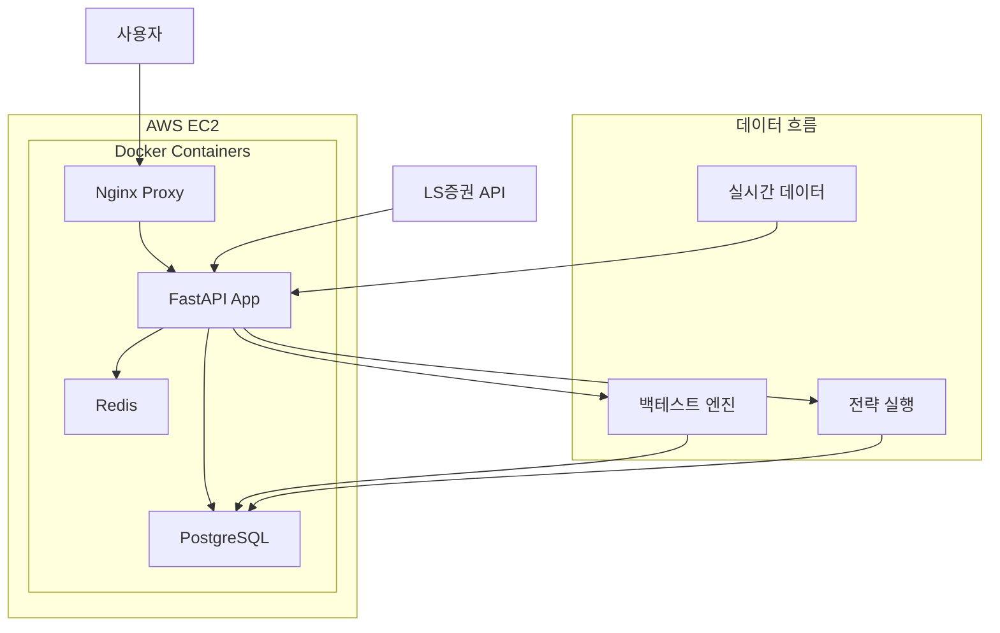

# LS증권 개인화 HTS - AWS 배포 가이드

## 🚀 빠른 배포 (자동화 스크립트 사용)

### 1단계: AWS EC2 인스턴스 생성
1. AWS 콘솔에서 EC2 인스턴스 생성
   - AMI: Ubuntu Server 22.04 LTS
   - 인스턴스 타입: t3.small 이상 권장 (t2.micro는 메모리 부족 가능)
   - 키 페어: 새로 생성하여 다운로드
   - 보안 그룹: HTTP(80), HTTPS(443), SSH(22) 포트 열기

### 2단계: 자동 배포 실행
```bash
# 환경 변수 설정
export AWS_INSTANCE_IP="your-ec2-public-ip"
export AWS_KEY_PATH="path/to/your-key.pem"

# 배포 스크립트 실행
./deploy/aws-deploy.sh
```

### 3단계: 설정 완료
1. SSH로 서버 접속하여 config.yaml 수정
```bash
ssh -i your-key.pem ubuntu@your-ec2-ip
cd ~/ls-hts
nano config.yaml  # LS증권 API 키 입력
```

2. 환경 변수 수정
```bash
nano .env  # JWT_SECRET_KEY 등 보안 설정 변경
```

3. 서비스 재시작
```bash
docker-compose -f deploy/docker-compose.prod.yml restart
```

---

## 🔧 수동 배포 (단계별)

### 1. 서버 준비

#### EC2 인스턴스 생성
- **인스턴스 타입**: t3.small (vCPU 2개, 메모리 2GB) 이상
- **스토리지**: 30GB 이상
- **보안 그룹**: 
  - SSH (22): 내 IP
  - HTTP (80): 0.0.0.0/0
  - HTTPS (443): 0.0.0.0/0

#### 초기 설정
```bash
# SSH 접속
ssh -i your-key.pem ubuntu@your-ec2-ip

# 시스템 업데이트
sudo apt update && sudo apt upgrade -y

# Docker 설치
curl -fsSL https://get.docker.com -o get-docker.sh
sudo sh get-docker.sh
sudo usermod -aG docker ubuntu

# Docker Compose 설치
sudo curl -L "https://github.com/docker/compose/releases/latest/download/docker-compose-$(uname -s)-$(uname -m)" -o /usr/local/bin/docker-compose
sudo chmod +x /usr/local/bin/docker-compose

# 재로그인 (Docker 그룹 적용)
exit
ssh -i your-key.pem ubuntu@your-ec2-ip
```

### 2. 코드 배포

```bash
# Git 설치
sudo apt install -y git

# 프로젝트 클론
git clone https://github.com/greatjins/si-trading-system.git
cd si-trading-system
```

### 3. 환경 설정

```bash
# 환경 변수 파일 생성
cp .env.example .env
nano .env  # 필요한 값들 수정

# LS증권 API 설정
cp config.yaml.example config.yaml
nano config.yaml  # API 키 입력
```

### 4. 서비스 시작

```bash
# Docker 컨테이너 빌드 및 시작
docker-compose -f deploy/docker-compose.prod.yml up --build -d

# 상태 확인
docker-compose -f deploy/docker-compose.prod.yml ps
docker-compose -f deploy/docker-compose.prod.yml logs -f
```

---

## 📊 시스템 아키텍처



---

## 🔒 보안 설정

### 1. 환경 변수 보안
```bash
# .env 파일 권한 설정
chmod 600 .env

# 강력한 JWT 시크릿 키 생성
openssl rand -hex 32
```

### 2. 방화벽 설정
```bash
# UFW 방화벽 활성화
sudo ufw enable
sudo ufw allow 22/tcp   # SSH
sudo ufw allow 80/tcp   # HTTP
sudo ufw allow 443/tcp  # HTTPS
sudo ufw status
```

### 3. SSL 인증서 (Let's Encrypt)
```bash
# 도메인이 있는 경우
sudo apt install certbot
sudo certbot certonly --standalone -d your-domain.com

# Nginx 설정에 SSL 추가
# deploy/nginx.prod.conf의 HTTPS 섹션 주석 해제
```

---

## 📈 모니터링 및 로그

### 로그 확인
```bash
# 전체 서비스 로그
docker-compose -f deploy/docker-compose.prod.yml logs -f

# 특정 서비스 로그
docker-compose -f deploy/docker-compose.prod.yml logs -f app
docker-compose -f deploy/docker-compose.prod.yml logs -f postgres
docker-compose -f deploy/docker-compose.prod.yml logs -f nginx
```

### 시스템 모니터링
```bash
# 리소스 사용량
docker stats

# 디스크 사용량
df -h

# 메모리 사용량
free -h
```

### 헬스 체크
```bash
# API 헬스 체크
curl http://your-ec2-ip/health

# 데이터베이스 연결 확인
docker-compose -f deploy/docker-compose.prod.yml exec postgres pg_isready -U hts_user
```

---

## 🔄 업데이트 및 유지보수

### 코드 업데이트
```bash
# 로컬에서 변경사항 푸시
git add .
git commit -m "Update: 변경 내용"
git push

# 서버에서 업데이트
cd ~/si-trading-system
git pull
docker-compose -f deploy/docker-compose.prod.yml up --build -d
```

### 데이터베이스 백업
```bash
# 백업 생성
docker-compose -f deploy/docker-compose.prod.yml exec postgres pg_dump -U hts_user hts > backup_$(date +%Y%m%d).sql

# 백업 복원
docker-compose -f deploy/docker-compose.prod.yml exec -T postgres psql -U hts_user hts < backup_20241213.sql
```

### 서비스 재시작
```bash
# 전체 서비스 재시작
docker-compose -f deploy/docker-compose.prod.yml restart

# 특정 서비스만 재시작
docker-compose -f deploy/docker-compose.prod.yml restart app
```

---

## 🚨 문제 해결

### 메모리 부족 (t2.micro/t3.micro)
```bash
# 스왑 파일 생성 (2GB)
sudo fallocate -l 2G /swapfile
sudo chmod 600 /swapfile
sudo mkswap /swapfile
sudo swapon /swapfile
echo '/swapfile none swap sw 0 0' | sudo tee -a /etc/fstab
```

### 컨테이너 시작 실패
```bash
# 로그 확인
docker-compose -f deploy/docker-compose.prod.yml logs app

# 컨테이너 상태 확인
docker ps -a

# 이미지 재빌드
docker-compose -f deploy/docker-compose.prod.yml build --no-cache
```

### 데이터베이스 연결 실패
```bash
# PostgreSQL 컨테이너 상태 확인
docker-compose -f deploy/docker-compose.prod.yml exec postgres pg_isready

# 데이터베이스 재시작
docker-compose -f deploy/docker-compose.prod.yml restart postgres
```

### 포트 충돌
```bash
# 포트 사용 확인
sudo netstat -tulpn | grep :80
sudo netstat -tulpn | grep :5432

# 기존 서비스 중지
sudo systemctl stop apache2  # Apache가 80포트 사용 중인 경우
```

---

## 💰 비용 최적화

### AWS 프리티어 활용
- **EC2**: t2.micro (750시간/월, 12개월)
- **EBS**: 30GB (12개월)
- **데이터 전송**: 15GB/월

### 비용 모니터링
```bash
# AWS CLI 설치 후 비용 확인
aws ce get-cost-and-usage --time-period Start=2024-12-01,End=2024-12-31 --granularity MONTHLY --metrics BlendedCost
```

### 리소스 최적화
- 개발/테스트: t3.micro (1GB RAM)
- 소규모 운영: t3.small (2GB RAM)
- 본격 운영: t3.medium (4GB RAM)

---

## 📞 지원 및 문의

### 로그 수집 (문제 발생 시)
```bash
# 시스템 정보 수집
echo "=== System Info ===" > debug_info.txt
uname -a >> debug_info.txt
docker --version >> debug_info.txt
docker-compose --version >> debug_info.txt

echo "=== Container Status ===" >> debug_info.txt
docker-compose -f deploy/docker-compose.prod.yml ps >> debug_info.txt

echo "=== Application Logs ===" >> debug_info.txt
docker-compose -f deploy/docker-compose.prod.yml logs --tail=100 app >> debug_info.txt

echo "=== System Resources ===" >> debug_info.txt
free -h >> debug_info.txt
df -h >> debug_info.txt
```

### 체크리스트
- [ ] EC2 인스턴스 생성 완료
- [ ] 보안 그룹 설정 완료
- [ ] Docker 설치 완료
- [ ] 프로젝트 클론 완료
- [ ] 환경 변수 설정 완료
- [ ] config.yaml API 키 입력 완료
- [ ] 컨테이너 시작 완료
- [ ] 헬스 체크 통과
- [ ] 웹 접속 확인 완료
- [ ] SSL 인증서 설정 (선택)
- [ ] 도메인 연결 (선택)
- [ ] 백업 설정 완료

---

## 🎯 다음 단계

1. **CI/CD 파이프라인 구축**
   - GitHub Actions 설정
   - 자동 테스트 및 배포

2. **모니터링 시스템**
   - Prometheus + Grafana
   - 알림 시스템 구축

3. **고가용성 구성**
   - 로드 밸런서 설정
   - 다중 인스턴스 구성

4. **성능 최적화**
   - 캐싱 전략 개선
   - 데이터베이스 최적화

5. **보안 강화**
   - WAF 설정
   - 침입 탐지 시스템