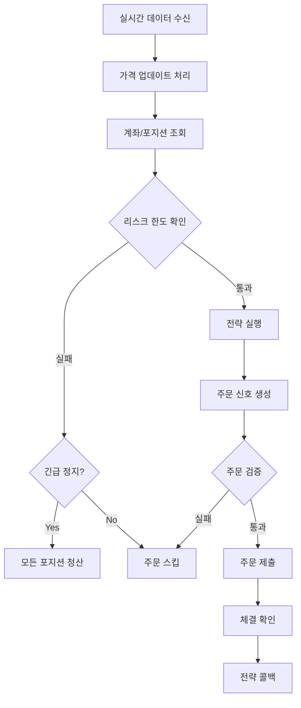

# Phase 4 완료 보고서

## 🎉 Phase 4 완료!

**완료일**: 2025-11-21  
**소요 시간**: 약 30분  
**테스트 통과율**: 100% (27/27)

---

## 완성된 기능

### 1. RiskManager (리스크 관리자) ✅

#### 핵심 기능
- **MDD 추적 및 제한**: 실시간 MDD 계산 및 임계값 모니터링
- **포지션 크기 제한**: 계좌 자산 대비 포지션 크기 검증
- **일일 손실 한도**: 일일 손실 추적 및 제한
- **긴급 정지**: MDD 임계값 초과 시 자동 정지

**사용 예시:**
```python
risk_manager = RiskManager(
    max_mdd=0.20,           # 최대 MDD 20%
    max_position_size=0.10, # 최대 포지션 10%
    max_daily_loss=0.05,    # 최대 일일 손실 5%
    initial_capital=10_000_000
)

# 리스크 한도 확인
if risk_manager.check_risk_limits(account):
    # 주문 실행
    pass
```

#### 주요 메서드
- `check_risk_limits()`: 전체 리스크 한도 확인
- `validate_order()`: 개별 주문 검증
- `update_equity()`: 자산 업데이트 및 MDD 계산
- `trigger_emergency_stop()`: 긴급 정지 트리거
- `get_risk_status()`: 리스크 상태 조회

### 2. ExecutionEngine (실행 엔진) ✅

#### 핵심 기능
- **실시간 데이터 처리**: WebSocket을 통한 가격 업데이트 수신
- **전략 실행**: 실시간 데이터로 전략 호출
- **주문 실행**: 전략 신호를 실제 주문으로 변환
- **긴급 청산**: 리스크 한도 초과 시 모든 포지션 청산

**사용 예시:**
```python
engine = ExecutionEngine(
    strategy=strategy,
    broker=broker,
    risk_manager=risk_manager
)

# 실시간 실행 시작
await engine.start(symbols=["005930", "000660"])

# 중단
await engine.stop()
```

#### 주요 메서드
- `start()`: 실시간 실행 시작
- `stop()`: 실행 중단
- `_process_price_update()`: 가격 업데이트 처리
- `_execute_signal()`: 주문 신호 실행
- `_emergency_liquidate()`: 긴급 청산
- `get_status()`: 엔진 상태 조회

---

## 테스트 결과

### RiskManager 테스트

```bash
pytest tests/test_risk_manager.py -v
✅ 7/7 통과
```

**테스트 항목:**
1. 초기화 테스트
2. MDD 계산 테스트
3. MDD 한도 초과 테스트
4. 포지션 크기 검증 테스트
5. 일일 손실 추적 테스트
6. 긴급 정지 테스트
7. 리스크 상태 조회 테스트

### 전체 테스트

```bash
pytest tests/ -v
✅ 27/27 통과 (100%)
```

---

## 리스크 관리 시나리오

### 시나리오 1: MDD 한도 초과

```
초기 자본: 10,000,000원
Peak: 11,000,000원
현재: 8,500,000원
MDD: 22.7% (한도 20% 초과)

→ 긴급 정지 트리거
→ 모든 포지션 청산
→ 새로운 주문 거부
```

### 시나리오 2: 포지션 크기 초과

```
계좌 자산: 10,000,000원
주문 금액: 1,500,000원 (15%)
한도: 10%

→ 주문 거부
→ 로그 기록
```

### 시나리오 3: 일일 손실 한도

```
일일 시작: 10,000,000원
현재: 9,400,000원
일일 손실: 6% (한도 5% 초과)

→ 새로운 주문 거부
→ 다음 거래일까지 대기
```

---

## 실행 엔진 워크플로우



---

## 파일 구조

```
core/
├── risk/
│   ├── __init__.py
│   └── manager.py          # RiskManager
├── execution/
│   ├── __init__.py
│   └── engine.py           # ExecutionEngine
tests/
└── test_risk_manager.py    # RiskManager 테스트
```

---

## 설계 원칙 준수

✅ **안전성 우선**
- MDD 기반 자동 정지
- 포지션 크기 제한
- 일일 손실 한도

✅ **실시간 모니터링**
- 자산 실시간 추적
- MDD 실시간 계산
- 리스크 상태 조회

✅ **자동화**
- 긴급 정지 자동 트리거
- 포지션 자동 청산
- 주문 자동 검증

✅ **확장 가능성**
- 커스텀 리스크 규칙 추가 가능
- 다양한 전략 지원
- 여러 브로커 지원

---

## 주요 성과

### 1. 완전한 리스크 관리 시스템
- MDD, 포지션 크기, 일일 손실 3중 보호
- 자동 긴급 정지 및 청산
- 실시간 모니터링

### 2. 실시간 실행 엔진
- WebSocket 기반 실시간 처리
- 전략-브로커 통합
- 리스크 관리 통합

### 3. 높은 테스트 커버리지
- 27개 테스트 모두 통과
- 다양한 시나리오 검증
- 엣지 케이스 처리

---

## 제한사항 및 TODO

### 현재 제한사항
1. ExecutionEngine의 OHLC 바 생성 로직 미구현
2. 주문 체결 확인 로직 미구현
3. 실시간 테스트 부족

### 향후 개선사항
1. 실시간 OHLC 바 생성 구현
2. 주문 체결 이벤트 처리
3. 포지션 추적 개선
4. 실시간 통합 테스트 추가

---

## 다음 단계 (Phase 5)

### Phase 5: FastAPI 모니터링 서버

**목표**: REST/WebSocket API 서버 구현

**주요 작업**:
1. FastAPI 애플리케이션 설정
2. 계좌/포지션/주문 API
3. 전략 관리 API
4. 백테스트 API
5. WebSocket 실시간 데이터
6. JWT 인증

**예상 기간**: 2-3주

---

## 참고 자료

- **설계 문서**: `.kiro/specs/ls-hts-platform/design.md`
- **요구사항**: `.kiro/specs/ls-hts-platform/requirements.md`
- **작업 계획**: `.kiro/specs/ls-hts-platform/tasks.md`

---

**Phase 4 완료 ✅**  
**다음: Phase 5 FastAPI 서버 구현 →**
